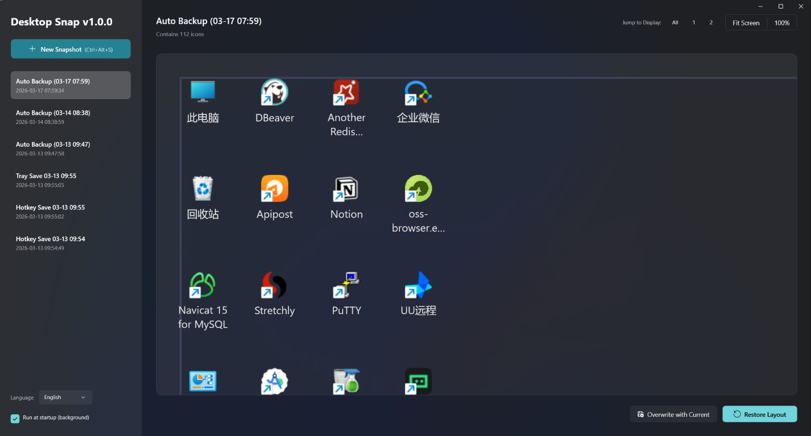

# DesktopSnap

[简体中文](README_ZH.md) | English

<p align="center">
  
</p>

**DesktopSnap** is a lightweight, powerful desktop icon layout management tool for Windows. It allows you to take "snapshots" of your desktop icon positions and restore them instantly, which is especially useful for users with multiple monitors, those who frequently change resolutions, or gamers whose icons get scrambled after exiting full-screen applications.

## 🌟 Features

- **Icon Snapshots**: Save multiple desktop layouts and switch between them at any time.
- **Multi-Monitor Support**: Intelligent handle layouts across multiple displays.
- **DPI & Resolution Awareness**: Automatically detects resolution or DPI changes and offers "Smart Scaling" to keep icons in their relative positions.
- **Visual Preview**: See exactly where icons will be placed before you restore a layout.
- **Global Hotkeys**: Quickly save or restore the latest snapshot using configurable hotkeys.
- **Auto-Backup**: Automatically creates temporary backups on system startup or shutdown to prevent accidental icon scrambling.
- **System Tray Integration**: Runs quietly in the background; minimize to tray to stay out of your way.
- **Multilingual Support**: Available in both English and Simplified Chinese.
- **Modern UI**: Built with WinUI 3 for a sleek, native Windows 11 experience.

## 🚀 Getting Started

1. **Snap**: Create a new snapshot of your current desktop layout.
2. **Preview**: Click on any snapshot in the sidebar to see a visual preview of your icons and displays.
3. **Restore**: Click "Restore Layout" to move icons back to their saved positions.
4. **Settings**: Enable "Run at startup" to ensure your layout is always protected.

### Prerequisites
- Windows 10 version 1809 (build 17763) or later.
- .NET 8.0 SDK or later.

## 🔨 Build

You can build the project using the command line:

```bash
dotnet publish -f net8.0-windows10.0.19041.0 -c Release -r win-x64 --self-contained true -p:Platform=x64                                  
```

## 🛠️ Built With

- **WinUI 3**: For the modern user interface.
- **H.NotifyIcon**: Robust system tray implementation.
- **Win32 API**: Low-level desktop icon and hotkey management.

## 🌐 Localization

The application automatically detects your system language (supports English and Chinese). You can also manually switch languages in the settings menu.

## 🌐 Contact Me

- **Blog**: [liuhouliang.com/post/desktop-snap](https://liuhouliang.com/en/post/desktop-snap/)

## 📄 License

This project is licensed under the [MIT License](LICENSE).