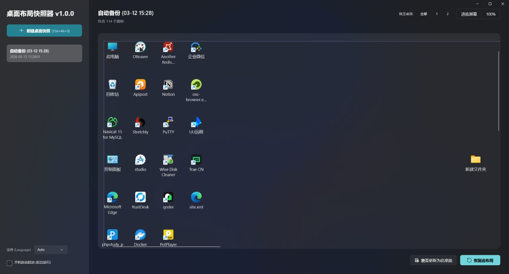

# 桌面布局快照器 (DesktopSnap)

简体中文 | [English](README.md)

<p align="center">
  
</p>

**桌面布局快照器** 是一款轻量且强大的 Windows 桌面图标布局管理工具。它可以为您记录下桌面图标的“快照”，并能在任何时候瞬间恢复。对于使用多显示器、频繁切换分辨率的用户，或者在退出全屏游戏后发现桌面图标乱掉的玩家来说，这是一款必备神器。

## 🌟 功能特色

- **图标快照**：保存多份桌面布局记录，随时自由切换。
- **多显示器支持**：智能处理跨显示器的布局，支持各种复杂的排列组合。
- **分辨率与 DPI 适配**：自动监测分辨率或 DPI 的变动，并提供“按比例缩放”功能，确保图标在不同环境下都能保持在相对位置。
- **视觉预览**：在恢复布局前，可以直观地查看到每个图标所在的位置及显示器分布。
- **全局快捷键**：支持自定义快捷键，一键保存或恢复最新一次的快照。
- **自动备份**：在系统启动或关闭时自动创建临时备份，防止以外导致的图标混乱。
- **系统托盘运行**：支持最小化到系统托盘，静默运行，不占用任务栏。
- **多语言支持**：原生支持简体中文和英文。
- **现代 UI 设计**：基于 WinUI 3 构建，拥有流畅、原生且美观的 Windows 11 风格界面。

## 🚀 快速上手

1. **创建快照**：点击“新建桌面快照”记录下当前的图标排列。
2. **预览**：在左侧列表中点击任意快照，右侧将显示其包含的图标和显示器布局预览。
3. **恢复**：点击“恢复此布局”，图标将自动归位。
4. **设置**：开启“开机自动启动”，让您的桌面始终受到保护。

### 运行环境要求
- Windows 10 版本 1809 (Build 17763) 或更高版本。
- .NET 8.0 SDK 或更高版本。

## 🔨 构建指南

您可以使用命令行进行构建：

```bash
dotnet publish -f net8.0-windows10.0.19041.0 -c Release -r win-x64 --self-contained true -p:Platform=x64                                  
```

## 🛠️ 技术栈

- **WinUI 3**：提供现代化的用户界面。
- **H.NotifyIcon**：提供稳定的系统托盘功能。
- **Win32 API**：用于底层桌面图标控制和全局快捷键注册。

## 🌐 语言设置

程序会自动检测系统语言（支持中英文）。您也可以在设置菜单中手动切换语言。

## 🌐 联系我

- **个人博客**: [liuhouliang.com/post/desktop-snap](https://liuhouliang.com/post/desktop-snap/)

## 📄 许可协议

本项目采用 [MIT 许可证](LICENSE)。